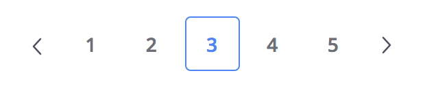

# Numbered Blog Pagination

**Purpose:** to add basic numbered pagination to a HubSpot blog. 

## Instructions 

Add this snippet in the blog listing template HTML outside of the main blog for loop where you want the pagination to show.

You can easily choose the number of links to display with the offset variable. It will generate from the (current page - offset) to (current + offset ) plus the current page.
So by default (2), if you are in the page num 3 you will see from 1 to 5.

If for any reason you want to choose the pages to display manually, for example if you we are in the page num 10 and want to display links to:
`< 5 8 9 10 11 12 15 >`, you can do it hardcoding the `page_list` array as in the commented line._(what are you doing weirdo?)_

